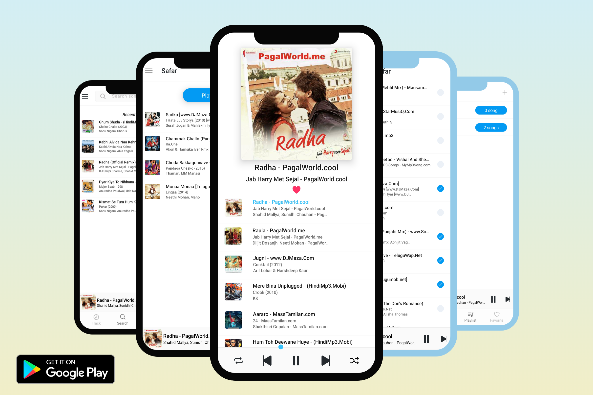
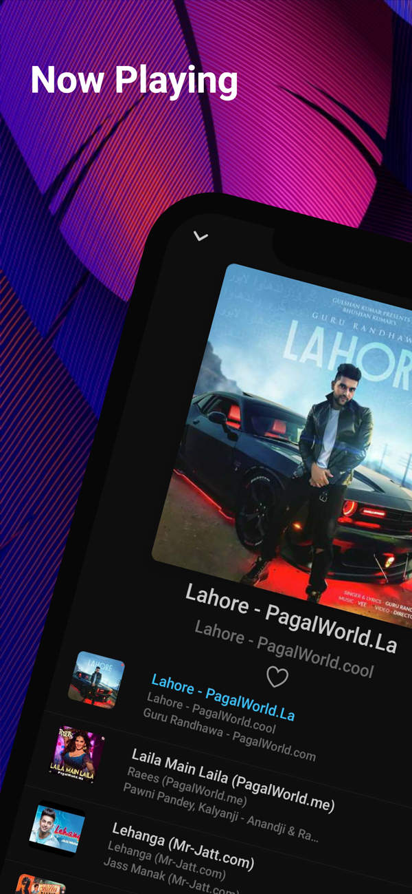
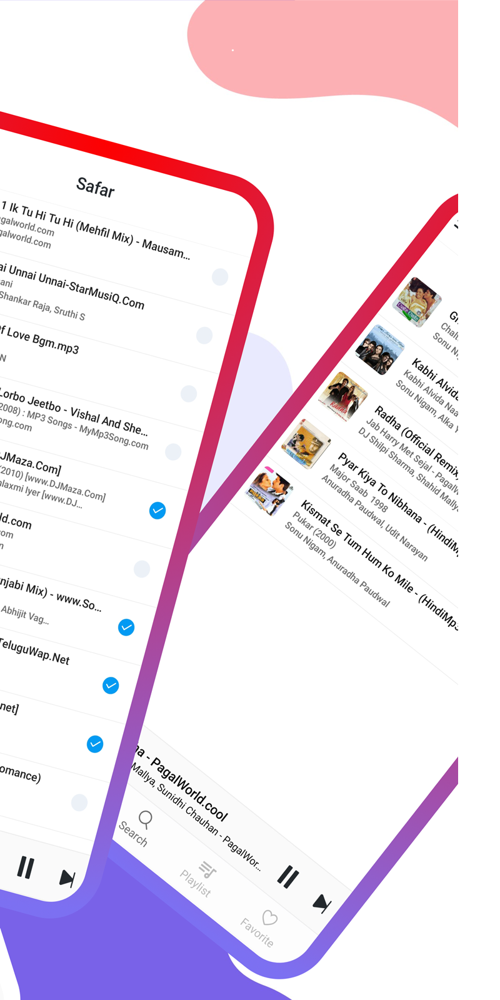
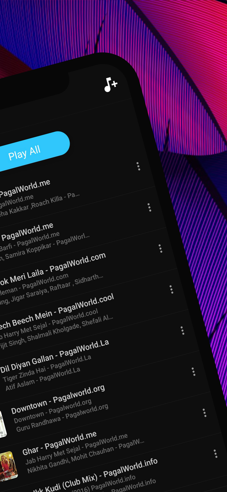
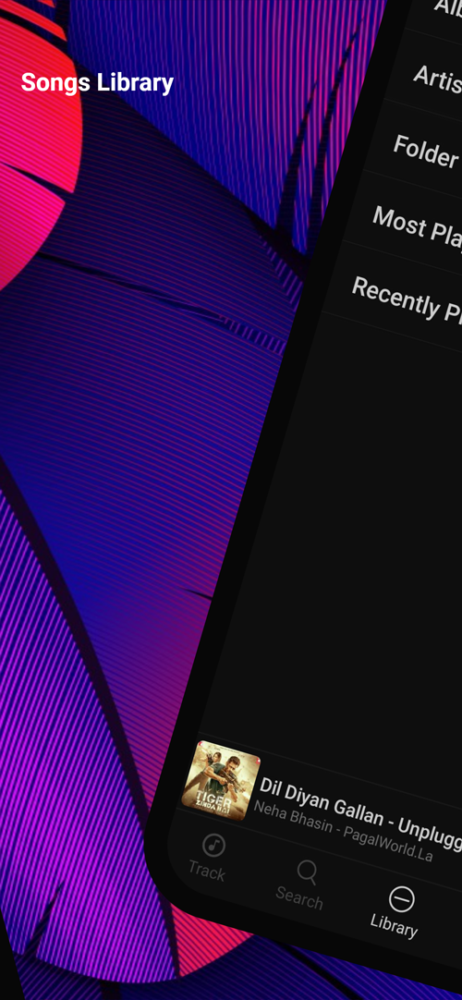
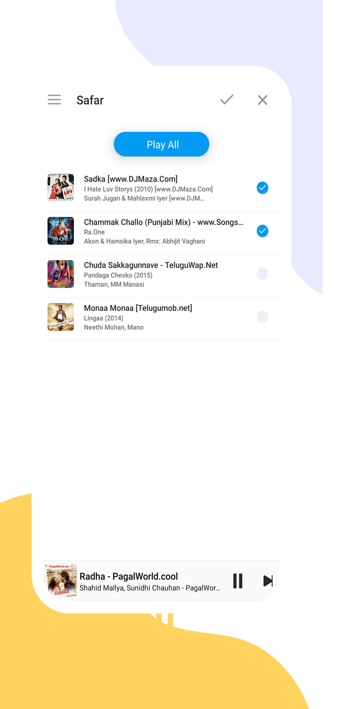

# ReactNative-MusicPlayer

steps to run the project 
<b> install node ,if not installed </b> link <a href="https://nodejs.org/en/">node.js</a> 

setup development environment for <b>react native</b> link <a href="https://reactnative.dev/docs/environment-setup">react-native-cli-Quickstart</a>
  

<b>step 1</b>: open cmd from root directory of the project
 

<b>step 2</b>: run command "<b>npm install</b>" to install the required dependency
 

<b>step 3</b>: then "<b>npm start</b>" to run the project

 <b style="margin-top:-20px">Download App</b>

 

  
  
  
  

  
  
  
  
  

    
    
  
    

